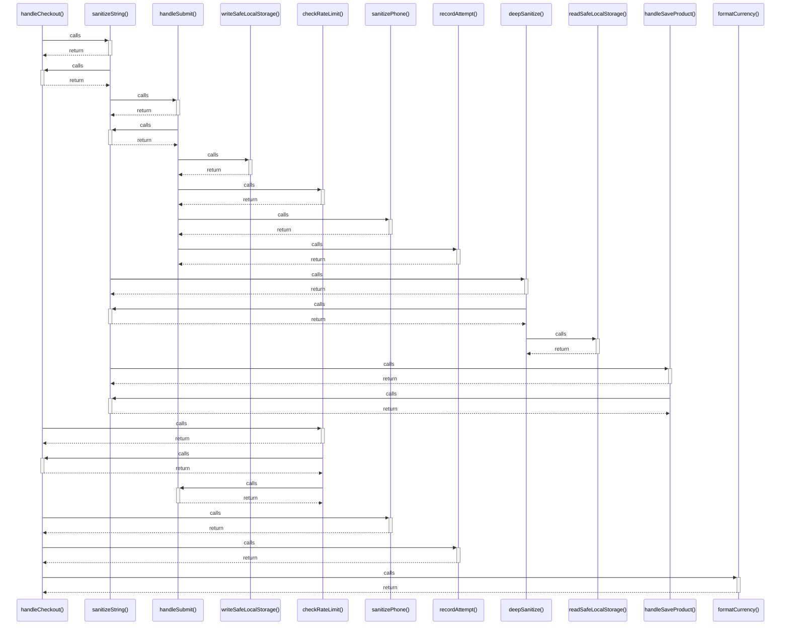

# handleCheckout()

> God node · 6 connections · [C:\Users\camil\Desktop\MarTemu\src\components\Cart.tsx](file:///C:/Users/camil/Desktop/MarTemu/src/components/Cart.tsx#L63)

## Call Trace Diagram

## Connections by Relation

### calls
- [[sanitizeString()]] `INFERRED`
- [[checkRateLimit()]] `INFERRED`
- [[sanitizePhone()]] `INFERRED`
- [[recordAttempt()]] `INFERRED`
- [[formatCurrency()]] `EXTRACTED`

### contains
- [[Cart.tsx]] `EXTRACTED`

---

*Part of the graphify knowledge wiki. See [[index]] to navigate.*