# Knowledge Graph Index

> Auto-generated by graphify. Start here — read community articles for context, then drill into god nodes for detail.

**201 nodes · 206 edges · 15 communities**

---

## System Architecture Flowchart

```mermaid
flowchart TD
    C0["Product Image Editor (49 nodes)"]
    C1["Product Catalog (24 nodes)"]
    C2["Community 2 (23 nodes)"]
    C3["Community 3 (22 nodes)"]
    C4["Subscription Dashboard (16 nodes)"]
    C5["Community 5 (16 nodes)"]
    C6["Community 6 (13 nodes)"]
    C7["Community 7 (13 nodes)"]
    C8["Community 8 (10 nodes)"]
    C9["Community 9 (6 nodes)"]
    C10["Community 10 (3 nodes)"]
    C11["unknown (2 nodes)"]
    C12["Community 12 (2 nodes)"]
    C13["unknown (1 nodes)"]
    C14["unknown (1 nodes)"]
    C0 -->|3 edges| C10
    C5 -->|2 edges| C2
    C3 -->|1 edges| C2
    C0 -->|1 edges| C2
```

## Communities
(sorted by size, largest first)

- [[Product Image Editor]] — 49 nodes
- [[Product Catalog]] — 24 nodes
- [[Community 2]] — 23 nodes
- [[Community 3]] — 22 nodes
- [[Subscription Dashboard]] — 16 nodes
- [[Community 5]] — 16 nodes
- [[Community 6]] — 13 nodes
- [[Community 7]] — 13 nodes
- [[Community 8]] — 10 nodes
- [[Community 9]] — 6 nodes
- [[Community 10]] — 3 nodes
- [[unknown]] — 2 nodes
- [[Community 12]] — 2 nodes
- [[unknown]] — 1 nodes
- [[unknown]] — 1 nodes

## God Nodes
(most connected concepts — the load-bearing abstractions)

- [[updateCartState()]] — 6 connections
- [[handleCheckout()]] — 6 connections
- [[handleSubmit()]] — 6 connections
- [[sanitizeString()]] — 5 connections
- [[writeSafeLocalStorage()]] — 4 connections
- [[processAndUploadFile()]] — 3 connections
- [[checkRateLimit()]] — 3 connections
- [[recordAttempt()]] — 3 connections
- [[sanitizePhone()]] — 3 connections
- [[deepSanitize()]] — 3 connections

---

*Generated by [graphify](https://github.com/safishamsi/graphify)*