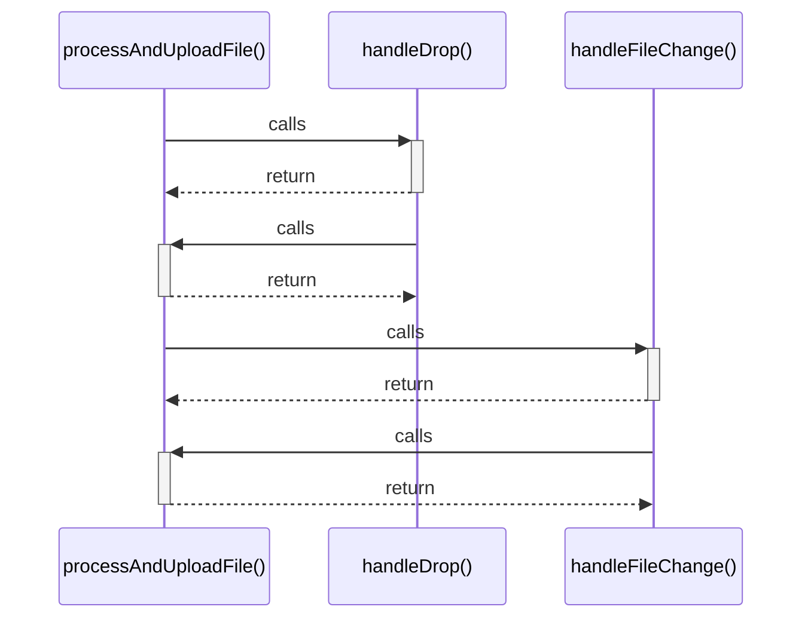

# processAndUploadFile()

> God node · 3 connections · [C:\Users\camil\Desktop\MarTemu\src\components\AdminCatalog.tsx](file:///C:/Users/camil/Desktop/MarTemu/src/components/AdminCatalog.tsx#L179)

## Call Trace Diagram

## Connections by Relation

### calls
- [[handleDrop()]] `EXTRACTED`
- [[handleFileChange()]] `EXTRACTED`

### contains
- [[AdminCatalog.tsx]] `EXTRACTED`

---

*Part of the graphify knowledge wiki. See [[index]] to navigate.*