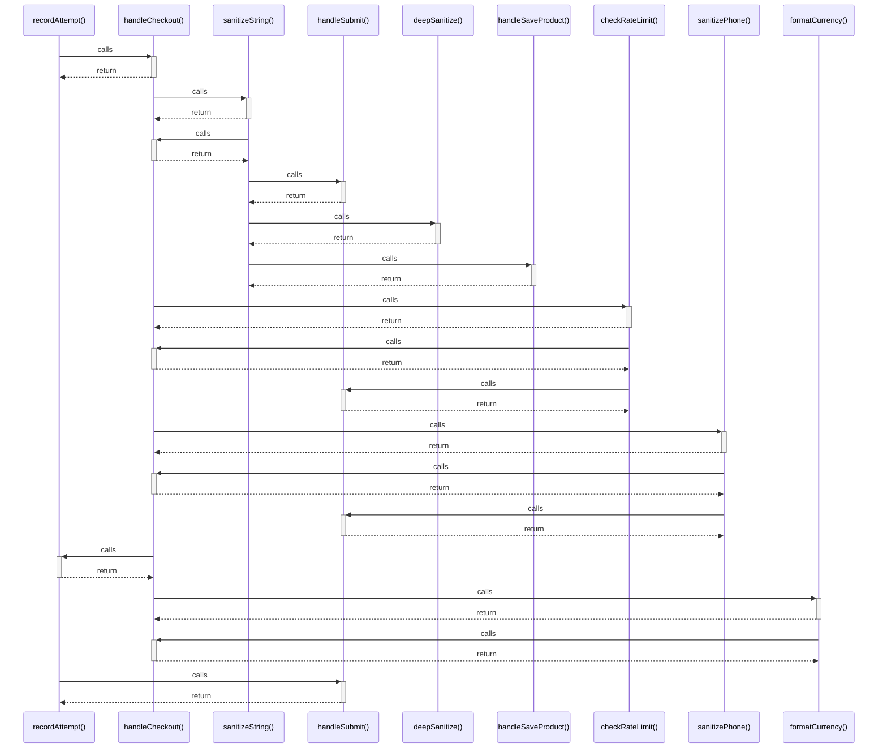

# recordAttempt()

> God node · 3 connections · [C:\Users\camil\Desktop\MarTemu\src\utils\rateLimiter.ts](file:///C:/Users/camil/Desktop/MarTemu/src/utils/rateLimiter.ts#L62)

## Call Trace Diagram

## Connections by Relation

### calls
- [[handleCheckout()]] `INFERRED`
- [[handleSubmit()]] `INFERRED`

### contains
- [[rateLimiter.ts]] `EXTRACTED`

---

*Part of the graphify knowledge wiki. See [[index]] to navigate.*