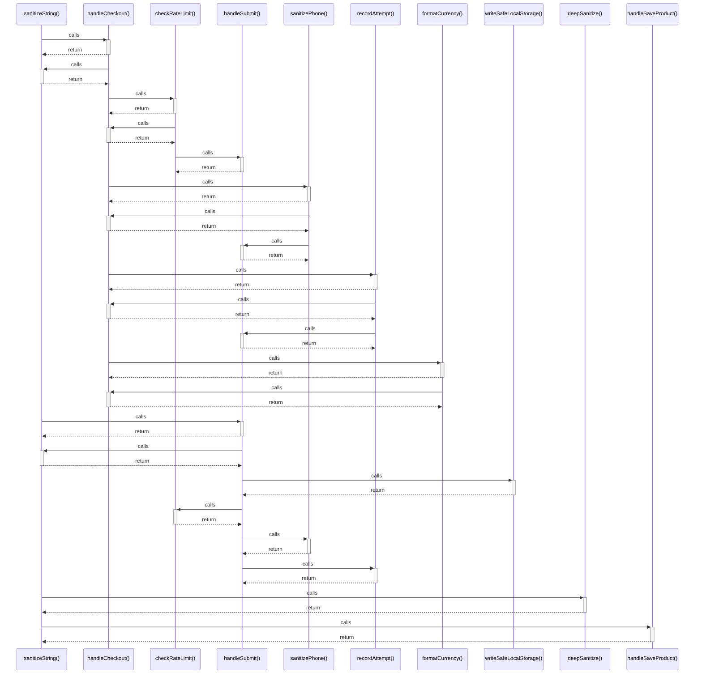

# sanitizeString()

> God node · 5 connections · [C:\Users\camil\Desktop\MarTemu\src\utils\sanitize.ts](file:///C:/Users/camil/Desktop/MarTemu/src/utils/sanitize.ts#L9)

## Call Trace Diagram

## Connections by Relation

### calls
- [[handleCheckout()]] `INFERRED`
- [[handleSubmit()]] `INFERRED`
- [[deepSanitize()]] `EXTRACTED`
- [[handleSaveProduct()]] `INFERRED`

### contains
- [[sanitize.ts]] `EXTRACTED`

---

*Part of the graphify knowledge wiki. See [[index]] to navigate.*