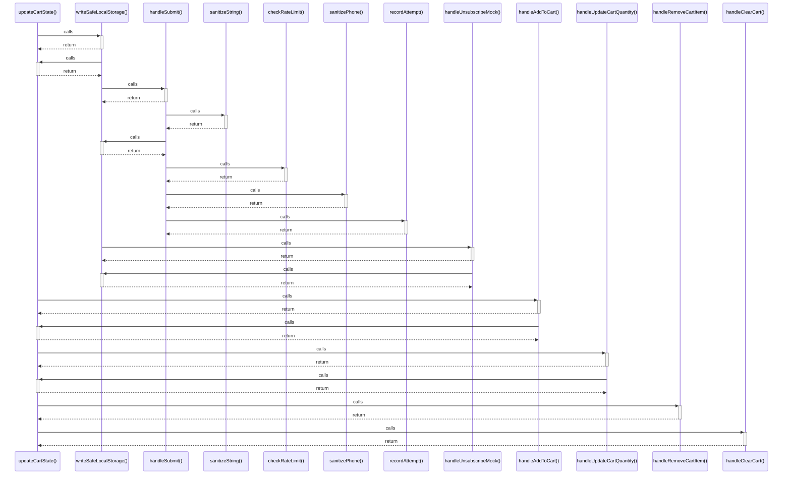

# updateCartState()

> God node · 6 connections · [C:\Users\camil\Desktop\MarTemu\src\App.tsx](file:///C:/Users/camil/Desktop/MarTemu/src/App.tsx#L115)

## Call Trace Diagram

## Connections by Relation

### calls
- [[writeSafeLocalStorage()]] `INFERRED`
- [[handleAddToCart()]] `EXTRACTED`
- [[handleUpdateCartQuantity()]] `EXTRACTED`
- [[handleRemoveCartItem()]] `EXTRACTED`
- [[handleClearCart()]] `EXTRACTED`

### contains
- [[App.tsx]] `EXTRACTED`

---

*Part of the graphify knowledge wiki. See [[index]] to navigate.*